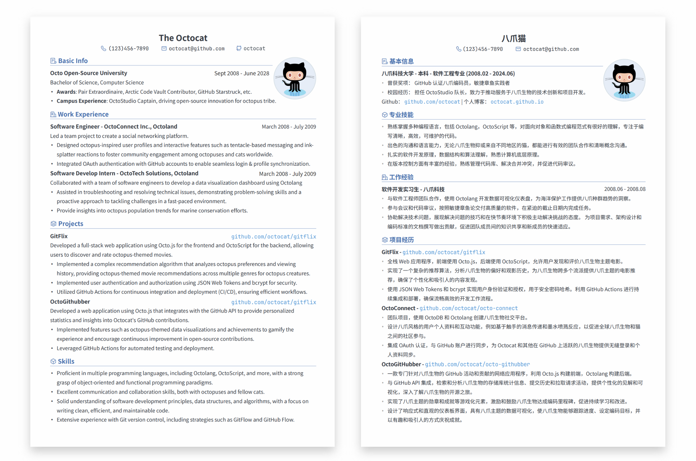
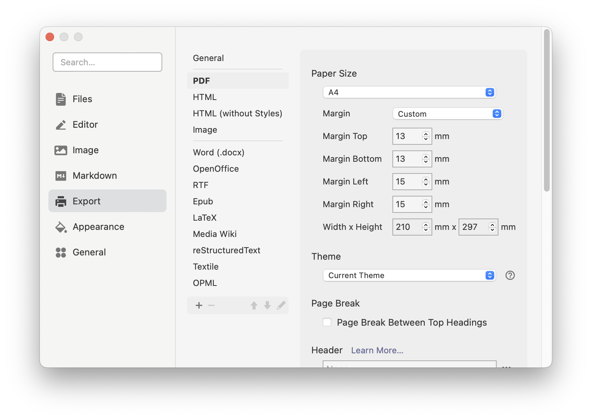
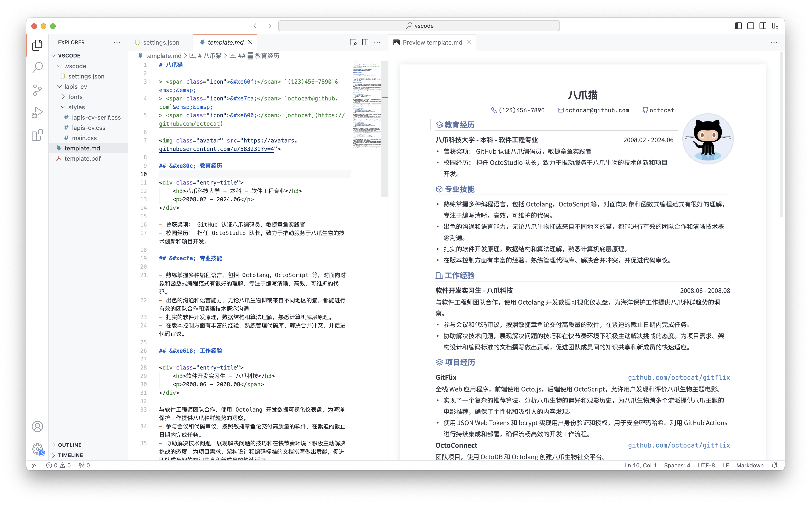

<p align="right"><a href="https://github.com/BingyanStudio/LapisCV/blob/main/README.md">English</a> / 简体中文</p>

<h1 align="center">
    LapisCV
</h1>
<p align="center">
    📄 通过 Markdown 轻松打造简历
</p>
<div align="center">
    
    &nbsp;
    
    &nbsp;
      
</div><br>

基于 Markdown，易于编辑，支持 **VSCode** / **Typora** / **Obsidian** 多平台。风格简洁正式，适用于大部分场景。

## 预览

<div align="center">
    
    <p>LapisCV Serif （v2.0.0 新增）</p>
    
    <p>LapisCV</p>
    
    <p>Typora 编辑页</p>
</div>

## 快速上手

### 安装

<details>

<summary>Typora</summary>

1. 下载 [Release](https://github.com/BingyanStudio/LapisCV/releases/latest) 并解压，设置主题：

   1. 打开 Typora 主题文件夹：`设置 > 外观 > 打开主题文件夹`
   2. 复制文件至主题文件夹：`lapis-cv.css`, `lapis-cv-serif.css`, `lapis-cv` 目录
   3. 重启 Typora，从主题菜单中选择 `Lapis Cv` / `Lapis Cv Serif`。

2. 打开 template 文件进行编辑。
3. `文件 > 导出 > PDF` 即可导出 PDF 文件。

   导出前需在 `设置 > 导出 > PDF` 中设置页面大小为 A4，页边距为自定义，上下边距为 13mm，左右边距为 15mm:

   
   
</details>

<details>

<summary>VSCode</summary>

1. 下载 [Release](https://github.com/BingyanStudio/LapisCV/releases/latest) 并解压，在 VSCode 中打开该文件夹。
2. 安装插件 [Markdown PDF](https://marketplace.visualstudio.com/items?itemName=yzane.markdown-pdf)。
3. 打开 template 文件，点击右上角预览图标实时查看效果：

   


   右键选择 Markdown PDF - Export (pdf) 即可导出 PDF 文件。

4. 切换主题：
   
   修改 `.vscode/settings.json` 中的样式路径：

   ```
   "markdown.styles": [
       "./lapis-cv/styles/main.css",
       "./lapis-cv/styles/lapis-cv.css", // lapis-cv-serif.css 对应 Serif
   ],
   ```

> VSCode 其他插件可能会影响样式，若效果不一致，请检查是否有插件影响。

</details>

<details>

<summary>Obsidian</summary>

<br>

下载并解压 [Release](https://github.com/BingyanStudio/LapisCV/releases/latest)，将 `lapis-cv-obsidian` 目录作为 Vault 在 Obsidian 打开，编辑 template 并导出 PDF 文件即可。


在 `设置 > 外观 > CSS 代码片段` 中切换主题


</details>

### 格式与样式

<details>

<summary>头像</summary>

<br>

```html

```

编辑头像时替换 src 图片路径即可，不带头像可删除该行

> Obsidian 无法识别 html 格式的本地图片插入，因此推荐将图片上传为链接再插入

</details>

<details>

<summary>Icons</summary>

<br>

目前支持的 Icon 列表，复制粘贴对应的转义 Unicode 至编辑器即可:


| Icon | Escaped Unicode | Icon | Escaped Unicode |
|------|-----------------|------|-----------------|
|  | `&#xe60f;` |  | `&#xe7ca;` |
|  | `&#xe600;` |  | `&#xe618;` |
|  | `&#xe80c;` |  | `&#xecfa;` |
|  | `&#xe69c;` |  | `&#xe6b3;` |
|  | `&#xe8ae;` |  | `&#xe782;` |
|  | `&#xe8b4;` |  | `&#xe603;` |
|  | `&#xe8b5;` |  | `&#xe638;` |
|  | `&#xe635;` |  | `&#xe673;` |

</details>

<details>

<summary>分页与页码</summary>

<br>

**分页**

在需要分页的位置插入 `---` 分隔线

**页码**

**Typora**

在 `设置 > 导出 > PDF` 中设置页脚，例如 `${pageNo} / ${totalPages}`

**VSCode**

修改 `.vscode/settings.json`：

```
"markdown-pdf.displayHeaderFooter": true,
"markdown-pdf.headerTemplate": "<div></div>",
"markdown-pdf.footerTemplate": "<div style=\"font-size: 9px; margin: 0 auto;\"> <span class='pageNumber'></span> / <span class='totalPages'></span></div>",
```

**Obsidian**

软件自身不支持直接添加页码，可自行安装插件

</details>

<details>

<summary>页边距</summary>

<br>

**Typora**

`设置 > 导出 > PDF > 页边距`

**VSCode**

- 直接修改 `.vscode/settings.json` 文件中的 `markdown-pdf.margin` 相关项。

- 另外的，还可以通过 GUI 进行修改：

  1. 打开 VSCode 设置，选中 Workspace 标签页。
  2. 搜索 Markdown-pdf › Margin，并修改四边边距。

**Obsidian**

修改样式文件中的 `--file-margins`，见下面的自定义样式

</details>

<details>

<summary>自定义样式</summary>

<br>

通过自定义样式，可以适配不同体量的内容 & 根据喜好调整细节。

在对应编辑器的样式文件 `lapis-cv.css` / `lapis-cv-serif.css` 中修改变量：

##### 样式文件位置

- Typora: `设置 > 外观 > 打开主题文件夹`
- VSCode: 文件夹内 `lapis-cv/styles`
- Obsidian: `设置 > 外观 > CSS 代码片段 > 右侧按钮 - 打开代码片段文件夹`

##### 部分自定义变量含义

```css

/* Custom Configs */

/* 基础配置 */
--text-size: 10pt;                      /* 文本字体大小 */
--line-height: 1.8;                     /* 文本行高 */
--avatar-width: 29mm;                   /* 头像宽度 */

/* 字体配置 */
--h1-size: 16pt;                        /* 一级标题字体大小 */
--h2-size: 12pt;                        /* 二级标题字体大小 */
--h3-size: 10.5pt;                      /* 三级标题字体大小 */
--blockquote-size: 9.3pt;               /* 信息栏字体大小 */

--text-font: 'SourceHanSansCN';         /* 文本字体 */
--title-font: 'SourceHanSerifCN';       /* 标题字体 */
--link-font: 'JetBrainsMono';           /* 链接字体 */
--code-font: 'JetBrainsMono';           /* 代码字体 */

/* 色彩 */
--color-accent: #4870ac;                /* 主题色 */
--text-normal: #353a42;                 /* 文本颜色，若需打印请改为纯黑 */
--link-color: #0563c1;                  /* 链接颜色 */

```

> Note: 部分样式需要重启应用才能生效

</details>

## 参与贡献

欢迎通过 [Issues](https://github.com/BingyanStudio/LapisCV/issues) 提交建议或通过 [Pull Request](https://github.com/BingyanStudio/LapisCV/pulls) 参与开发！

## 开源协议

本项目采用 [MIT License](https://github.com/BingyanStudio/LapisCV/blob/main/LICENSE) 授权

## Star History

[](https://starchart.cc/BingyanStudio/LapisCV)