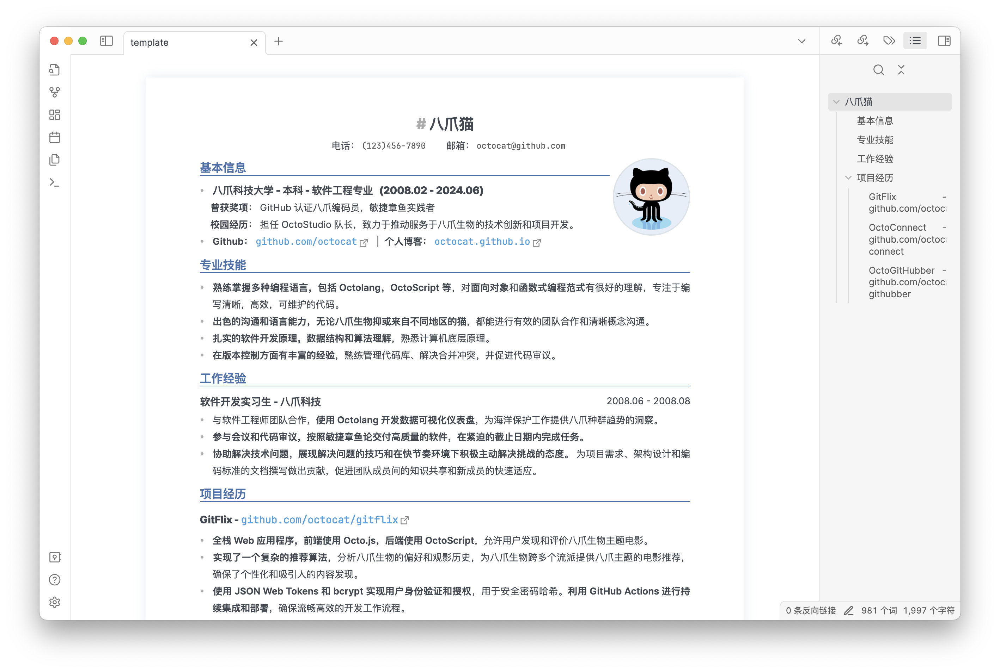
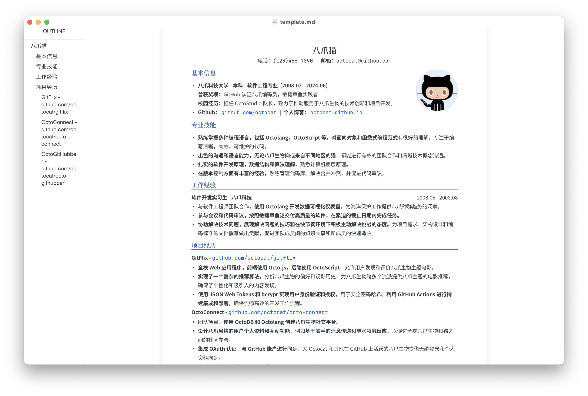
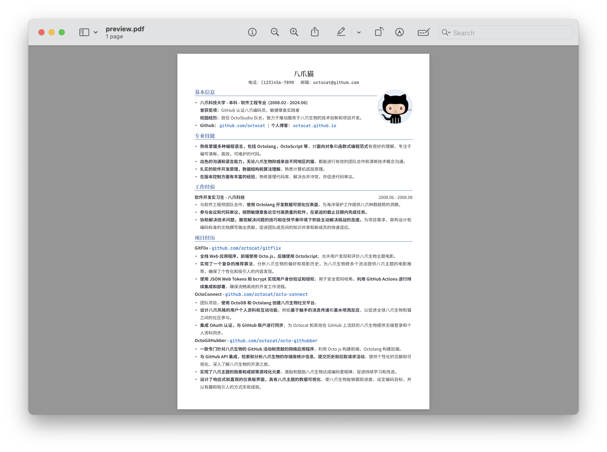

<h1 align="center">
    LapisCV
</h1>
<p align="center">
    📃 开箱即用的 Obsidian / Typora 简历
</p>
<div align="center">
    
    &nbsp;
    
    &nbsp;
      
</div><br>

基于 Markdown 格式，易于编辑，所见即所得。风格简洁正式，支持多页，适用于大部分求职 / 求学场景。

### 预览

- Obsidian / Typora 编辑页

<div align="center">
<div>


</div>
</div>

- [PDF样例](https://raw.githubusercontent.com/BingyanStudio/LapisCV/main/.assets/preview.pdf)

<br>
<div align="center">

</div>

### 安装与使用

#### Obsidian

下载 [Release](https://github.com/BingyanStudio/LapisCV/releases/latest)，将 `lapis-cv-obsidian` 目录作为 Vault 在 Obsidian 打开，编辑 template 并导出 PDF 文件即可。

#### Typora

1. 下载 [Release](https://github.com/BingyanStudio/LapisCV/releases/latest)，设置 Lapis Cv 作为主题：
   
    1. 在 Typora 菜单中选择 偏好设置 (Preferences) -> 找到外观部分，点击“打开主题文件夹”按钮
    2. 将 lapis-cv.css 和 lapis-cv 文件夹复制到 Typora 的主题文件夹中
    3. 重启 Typora，然后从主题列表中选择 Lapis Cv
    
3. 打开模版文件 [template.md](typora/template.md) 进行内容编辑，文件 - 导出 - PDF 即可导出 PDF 文件。

### 格式

- 一级标题：姓名块
- 二级标题：栏标题
- 三级标题：栏内子标题
- 引用块：联系方式块
- 分隔线：**分页标记**
  
  支持导出多页简历，可使用分隔线进行手动标记，导出的 PDF 会在分割线处进行一次分页。
- ``：头像，编辑头像时替换 src 图片路径即可，不带头像可删除该行
> Obsidian 无法识别 html 格式的本地图片插入，因此推荐将图片上传为链接再插入

### 自定义样式

支持自定义样式，便于适配不同体量的单页内容 & 根据喜好调整样式细节。

#### Obsidian

可在 设置 - 外观 中快速更换主题色与字体，其他样式在 `.obsidian/themes/lapis-cv.css` 修改。

#### Typora

修改主题文件夹中的 `lapis-cv.css` 并重启 Typora。

部分自定义变量含义如下：

```css
/* Custom Config */

:root {
    --text-size: 10pt;                      // 文本字体大小
    --line-height: 1.8;                     // 文本行高
    --avatar-width: 29mm;                   // 头像宽度

    --text-color: #353a42;                  // 文本颜色，若需打印请改为纯黑
    --primary-color: #4870ac;               // 主题色
    --link-color: #0563c1;                  // 链接颜色
    --shadow-color: #dae3eac9;
    --border-color: #dae3ea;

    --h1-size: 16pt;                        // 一级标题字体大小
    --h2-size: 12pt;                        // 二级标题字体大小
    --h3-size: 10.5pt;                      // 三级标题字体大小

    --text-font: 'SourceHanSansCN';         // 文本字体
    --title-font: 'SourceHanSerifCN';       // 标题字体
    --link-font: 'JetBrainsMono';           // 链接字体
    --code-font: 'JetBrainsMono';           // 代码字体
}

// 打印页边距
@media print {
    @page {
        margin: 12mm 6mm 0 6mm;             // 上边距 左边距 下边距 右边距
    }
}
```
