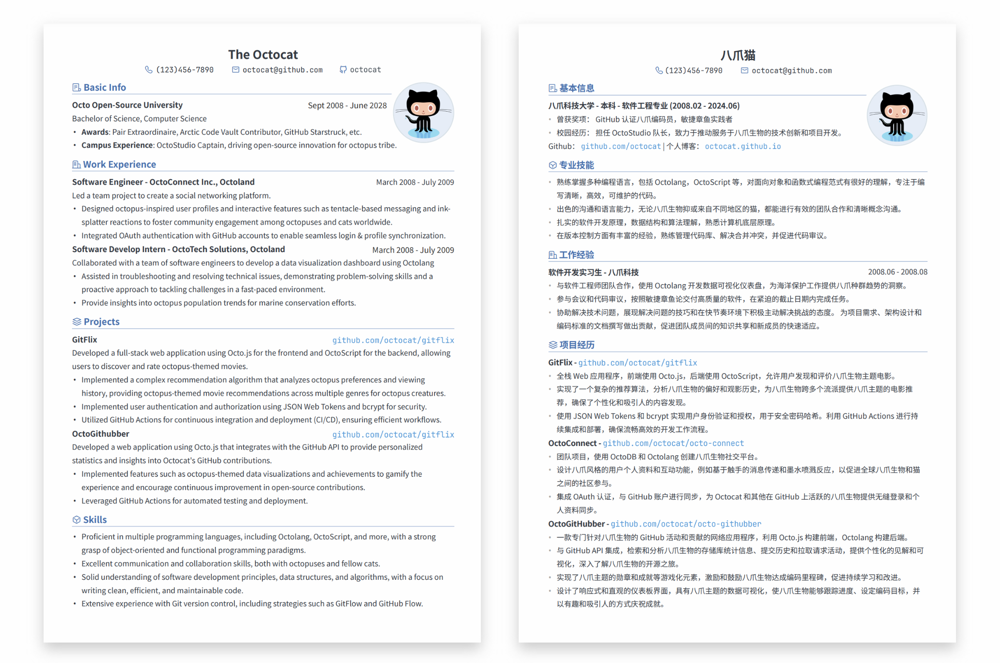
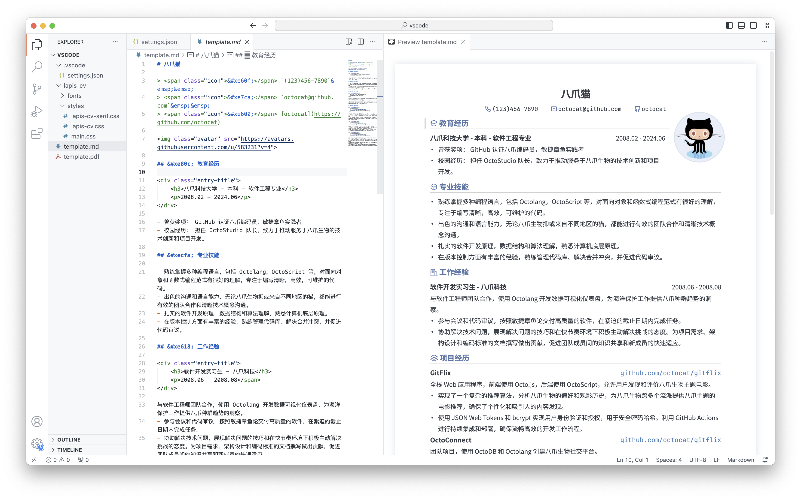

<p align="right">
	English / 
	<a href="https://github.com/BingyanStudio/LapisCV/blob/main/README-CN.md">
    简体中文
	</a>
</p>

<h1 align="center">
    LapisCV
</h1>
<p align="center">
    📄 Easily create resumes with Markdown on VSCode / Typora / Obsidian
</p>
<div align="center">
    
    &nbsp;
    
    &nbsp;
      
</div><br>

## View Samples

<div align="center">
    
    <p>LapisCV Serif (new in v2.0.0)</p>
    
    <p>LapisCV</p>
    
    <p>Typora Editor</p>
</div>


## Quick Start

### Installation

<details>

<summary>Typora</summary>

1. Download [Release](https://github.com/BingyanStudio/LapisCV/releases/latest) and unzip, set the theme:

   1. Open Typora theme folder: `Preferences > Appearance > Open Theme Folder`
   2. Copy files to the theme folder: `lapis-cv.css`, `lapis-cv-serif.css`, `lapis-cv` directory
   3. Restart Typora, select `Lapis Cv` / `Lapis Cv Serif` from the theme menu.

2. Open template file to edit.
3. `File > Export > PDF` to export the PDF file.

   Before exporting, set the page size to A4 and margins to custom in `Preferences > Export > PDF`, with top and bottom margins of 13mm, and left and right margins of 15mm:

   

</details>

<details>

<summary>VSCode</summary>

1. Download [Release](https://github.com/BingyanStudio/LapisCV/releases/latest) and unzip, open the folder in VSCode.
2. Install the plugin [Markdown PDF](https://marketplace.visualstudio.com/items?itemName=yzane.markdown-pdf).
3. Open template file, click the preview icon in the top right to view the effect in real-time:

   

   Right-click and select Markdown PDF - Export (pdf) to export the PDF file.

4. Switch themes:
   
   Modify the style path in `.vscode/settings.json`:

   ```
   "markdown.styles": [
       "./lapis-cv/styles/main.css",
       "./lapis-cv/styles/lapis-cv.css", // lapis-cv-serif.css for Serif
   ],
   ```

> Other VSCode plugins may affect the style. If the effect is inconsistent, check if any plugins are interfering.

</details>

<details>

<summary>Obsidian</summary>

<br>

Download and unzip [Release](https://github.com/BingyanStudio/LapisCV/releases/latest), open the `lapis-cv-obsidian` directory as a Vault in Obsidian, edit the template, and export the PDF file.


Switch themes in `Options > Appearance > CSS snippets`


</details>

### Format and Style

<details>

<summary>Avatar</summary>

<br>

```html

```

Replace the src image path when editing the avatar. Delete this line if no avatar is needed.

> Obsidian cannot recognize local images inserted in HTML format, so it is recommended to upload the image as a link before inserting.

</details>

<details>
<summary>Icons</summary>

<br>

Supported Icons:

| Icon | Escaped Unicode | Icon | Escaped Unicode |
|------|-----------------|------|-----------------|
|  | `&#xe60f;` |  | `&#xe7ca;` |
|  | `&#xe600;` |  | `&#xe618;` |
|  | `&#xe80c;` |  | `&#xecfa;` |
|  | `&#xe69c;` |  | `&#xe6b3;` |
|  | `&#xe8ae;` |  | `&#xe782;` |
|  | `&#xe8b4;` |  | `&#xe603;` |
|  | `&#xe8b5;` |  | `&#xe638;` |
|  | `&#xe635;` |  | `&#xe673;` |

</details>

<details>

<summary>Page Breaks & Page Numbers</summary>

<br>

**Page Breaks**

Insert `---` at the position where a page break is needed.

**Page Numbers**

**Typora**

Set the footer in `Preferences > Export > PDF`, e.g., `${pageNo} / ${totalPages}`

**VSCode**

Modify `.vscode/settings.json`:

```
"markdown-pdf.displayHeaderFooter": true,
"markdown-pdf.headerTemplate": "<div></div>",
"markdown-pdf.footerTemplate": "<div style=\"font-size: 9px; margin: 0 auto;\"> <span class='pageNumber'></span> / <span class='totalPages'></span></div>",
```

**Obsidian**

The software itself does not support adding page numbers directly. You can install plugins for this.

</details>

<details>

<summary>Margins</summary>

<br>

**Typora**

`Preferences > Export > PDF`

**VSCode**

- Directly modify the `markdown-pdf.margin` related items in the `.vscode/settings.json` file.

- Alternatively, modify via GUI:

  1. Open VSCode settings, select the Workspace tab.
  2. Search for Markdown-pdf › Margin, and modify the margins on all sides.

**Obsidian**

Modify `--file-margins` in the style file, see Custom Styles below.

</details>

<details>

<summary>Custom Styles</summary>

<br>

Custom styles can be used to adapt to different content volumes and adjust details according to preferences.

Modify variables in the corresponding editor's style file `lapis-cv.css` / `lapis-cv-serif.css`:

##### Style File Locations

- Typora: `Preferences > Appearance > Open Theme Folder`
- VSCode: `lapis-cv/styles` in the folder
- Obsidian: `Options > Appearance > CSS snippets > Right button - Open snippets folder`

##### Meanings of Some Custom Variables

```css

/* Custom Configs */

/* Basic Configs */
--text-size: 10pt;                      /* Text font size */
--line-height: 1.8;                     /* Text line height */
--avatar-width: 29mm;                   /* Avatar width */

/* Font Configs */
--h1-size: 16pt;                        /* Level 1 heading font size */
--h2-size: 12pt;                        /* Level 2 heading font size */
--h3-size: 10.5pt;                      /* Level 3 heading font size */
--blockquote-size: 9.3pt;               /* Info block font size */

--text-font: 'SourceHanSansCN';         /* Text font */
--title-font: 'SourceHanSerifCN';       /* Title font */
--link-font: 'JetBrainsMono';           /* Link font */
--code-font: 'JetBrainsMono';           /* Code font */

/* Colors */
--color-accent: #4870ac;                /* Theme color */
--text-normal: #353a42;                 /* Text color, change to pure black if printing is needed */
--link-color: #0563c1;                  /* Link color */

```

> Note: Some styles require restarting the application to take effect.

</details>

## Contributing

Welcome to submit suggestions via [Issues](https://github.com/BingyanStudio/LapisCV/issues) or participate in development via [Pull Request](https://github.com/BingyanStudio/LapisCV/pulls)!

### How to build from source code

```shell
git clone git@github.com:BingyanStudio/LapisCV.git
cd LapisCV
make
ls build
```

## License

This project is licensed under the [MIT License](https://github.com/BingyanStudio/LapisCV/blob/main/LICENSE).

## Star History

[](https://starchart.cc/BingyanStudio/LapisCV)